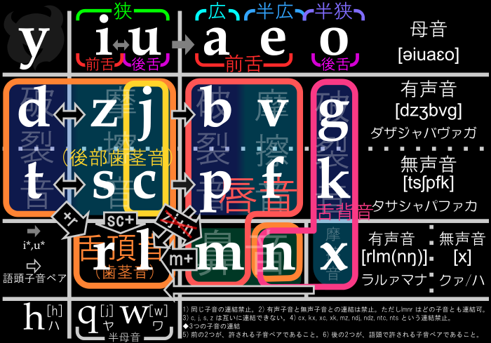

Lojban Words Analysis
======================
ロジバンの語根は話者数の多い言語から作られているが、ここでは意味や機能による規則的な語の生成を行う。

1) origin -> neatly -> result
   オリジナル、整頓、

## ゼルシー順
ロジバンの話を始める前に、もっと基礎的な部分について地盤固めをしたいと思う。その基礎的な部分とはズバリ、アルファベット順のことである。アルファベット順は流用と改造を繰り返した末にできた「成れの果て」であり、母音と子音すら分けられていないような、全く整理されていない非論理的な順である。

いろは歌から五十音順に並べ直した日本語のように整理した順を使用したい。ということで作成したのが以下の順である。６文字ごとに区切って表にすると画像のようになる。

    012345 678901 234567 8901 2 345
    yiuaeo dzjbvg tscpfk rlmn x hqw
    ʌɪuɔco dzəbty qsepfk jlɴn x ħɘɛ

※[ゼルシー](images/zercii.png)はこの順を利用して作った文字。

## gismu 分類をしていて気づいたこと、気になったこと
### 動植物のラインナップが明らかにおかしい
[不足している単語](docs/不足している単語.md)
* 動物が少なすぎる
    * 鳥類は鶏・キジ・アヒル・鴨と食い物ばかりである。
        * 鴨を家畜化したのがアヒル
        * タカ・フクロウ・ペンギン・ダチョウという語がない
    * 爬虫類がヘビしかない、トカゲ・カメという語がない
    * 両生類は蛙すらいない
        * 蛙＝跳ねる＋両生類
    * 哺乳類は比較的充実しているが、水生哺乳類が皆無
        * クジラ・イルカ・アザラシ
        * 犬と狼と狐、猫とライオンと虎が分かれてて、これはなくね？
    * というか水生生物はほぼ全滅である
        * 魚類もサメすらない
        * 貝・イカ・カニ・エビ
        * この偏りは意図的なのだろうか？
        * ロジバニストは海の生き物を呼称するとき一々全てに「海の」「水棲の」とか付けるつもりだろうか
* 植物も食い物ばかりである
    * そのくせキノコはないらしい
* 病院

### [不要なgismu](docs/%E5%BF%85%E8%A6%81%E3%81%AA%E3%81%84%E5%8D%98%E8%AA%9E.md)

## unofficial gismu
| kenka | ケーキ | 文明・人工物質・食品 |
| kibro | インターネット | 言語・情報媒体 |
| didni | 演繹 | 言語・認知 |
| nusna | 帰納 | 言語・認知 |
| sicpi | 雨 | 自然・地球・大気 |
| ditcu | 継続時間 | 時間 |
| volve | 帰る | 動作・自己移動・抽象概念 |
| gumri | 茸 | 生命・真菌 |
| parji | 寄生 | 生命 |

| rexsa | 恐竜 |  |
| dinso | 恐竜 |  |
| firca | いちゃつく |  |
| kanpe | 予期 |  |
| ninja | 忍者 |  |
| pilda | 青ざめる |  |

## Terminal commands
node lib/step1-xml-parser.js
node lib/step2-xml2js.js
node lib/step3-make-dictionary.js
node lib/step4-integrate-frequency.js
node lib/step5-integrate-thesaurus.js
node lib/yaml.js

## gismu patterns
全てのgismuはrafsiとして５文字目を抜いた４文字のものを持つため、実質４文字で意味を表す必要がある。
gismuは４つのパーツを組み合わせた２つのパターンで構成する。

	CCVcv  =  CC + V + c  + v
	cVccv  =  c  + V + cc + v

* c) 子音
* cc) 二重子音
* CC) 語頭で許される二重子音
* V) 最初の母音
* v) 末尾母音

### パーツ
gismuを漢字に例えるならパーツは部首に相当する。
まずはそれぞれのパーツにどのような意味を持たせるかを考えるためにc、cc、CC、V、vを分析する。
17文字の子音があるが`x`は特殊な文字として残しておきたいので別計算とする。特殊な文字というのは、標準の単語ではないことを示したりするのに使うことなどを想定している。
ただし意味の分類などで`x`を使用したほうが分かりやすいと思えば、標準の文字として使用していく方針。

#### c) 子音 16 + 1 = (dzjbvg tscpfk rlmn) + (x)
`b`と`v`、`p`と`f`、`r`と`l`、`m`と`n`の組み合わせはなるべく被らないようにする。

例：
`stave`というgismuを作ったら`stabe`というgismuは作らない。

#### CC) 語頭で許される二重子音 40+4+2
dz dj ts tcの４つの二重子音はgismuでは使用しない。個人的見解だが`dz`と`dj`は発音・聞き分けともに難しいので特に使用したくない。

#### cc) 二重子音 159+4+16
語頭でない場合でもなるべくCCの組み合わせを採用したい。
多言語でよく使われる二重子音を出現頻度でリストアップして参考にしたい。
lib/cc_frequency.js

#### V) 最初の母音 5　iuaeo
* a  大、上
* e  中、並
* o  小、下

良悪、男女

#### v) 末尾母音 5　iuaeo
末尾母音は意味分類として使用しない。３文字rafsiのバリエーション。
男言葉、女言葉。
* i  1
* u  0 - rafsiなし
* a  2
* e  2
* o  3

### パターン
	CCVcv  = 40 * 5 * 16 = 3200
	CCVcv  = 40 * 5 * 12 = 2400
	cVccv  = 16 * 5 * 159 = 12720

### パターンをどう使い分けるか：それぞれのパターンにどのような意味を持たせるか
#### 注意するべきこと
* rafsi=cmavoの形になるもの
    * claxu-cau-： X1はX2を欠く
* https://ja.wikibooks.org/wiki/Lojban_For_Beginners_日本語訳/合成語（_lujvo_）
* [lujvoの分解](https://togetter.com/li/518591)

#### アイディア
* CCVcvとcVccvの使い分け
    * ~~意味の大小：CCVcvは意味の大きい言葉、生物や時間など。cVccvは意味の小さい言葉、牛、秒など~~
        * これは階層に切りがないので却下。例：「生物→動物→哺乳類→犬→狐」
* 母音を大きさの指標とする。小さいものから順にiuaeoと大きくなる。
* 母音：
    * 優劣がある対となるもの「大小」「上下」などを`iu`
        * `i`が小さく、`u`が大きい
    * 中間的なものを`a`
    * 優劣のない対となるもの「男女」「左右」などを`eo`

* 「母」という単語は「mama」的な音にする
    * 赤ん坊が最初に発音する音が「んま」的な音であるのは世界共通であり、
    * この「んまんま」に近い音は「母」か「ご飯」を意味している言語が多い
    * 赤ん坊にとっては「母＝ご飯（母乳）」でもある
    * 「mama＝食べ物」にしてもよいのだが、世の全ての母に感謝を込めて「mama＝母」を採用する
    * この件以上に根源的ものは思い当たらないため、ここを手がかりとして進める
    * https://en.wikipedia.org/wiki/Mama_and_papa
    * もちろんgismuにするときに「mama」ではなくなってしまうが近い音にするということ
* 「食べ物」
* 「睡眠」
* 「道具」服

* 数学的表現は世界共通だと思うので、ロジバンをそのまま使う
    * pai：π、
    * kilto-ki'o-：キロ
        * メガ

* https://ja.wikipedia.org/wiki/ブーバ/キキ効果
    * 円唇　uo（ブーバ）、柔らかい、大きい
    * 非円唇　iaɛə（キキ）、硬い、小さい
    * 個人的には
        * 「a」は明瞭
        * 「ɛ」は曖昧
        * 「i」鋭いもの、すばやい動き、小さい
            * mini, tii(ちい)
        * 「u」柔らかさ、鈍重な動き、大きなもの

* https://ja.wikipedia.org/wiki/音象徴
    * 舌背音に分類される子音（kgxn）と狭母音で構成される音節は小さいものをあらわす
    * 閉鎖音に分類される子音（bp）は突然の現象をあらわす
    * 持続音に分類される子音は持続する現象をあらわす
        * ずっと
    * ふるえ音(r)はすばやく空を切るような動きをあらわす
    * 鼻音(mn)は反響や何かの鳴る音をあらわす
* 「ごろごろ」と「ころころ」

* 名詞的、動詞的、形容詞的gismu
    * rafsiパターン

* 法制詞

* 例えばccvの部分で道具を意味し
    * cで16の道具を表現
* 形容の単語はrafsiとして使うことも多いので合成しやすいよう子音で終わらせる

barda-bra-（大きい）：
cmalu-cma-（小さい）：
clani-cla-（長い）：
tordu-tor-to'u-（短い）：to'u＝心態詞（談話系）； 話を手短に済ませる；
clira-lir-（早い）：
lerci-lec-（遅い）：
sutra-sut-（速い）：
masno-sno-（遅い）：
condi-con-cno-coi-（深い）：
caxno-cax-（浅い）：
ganra-gan-（広い）：
jarki-jak-（狭い）：
rotsu-rot-tsu-ro'u-（厚い）：
cinla--（細い）：

# 使用する子音の厳選
     d  z  j  b  v  g  t  s  c  p  f  k  r  l  m  n
    ------------------------------------------------ c= 16
    dr zd jd br vr gr tr st ct pr fr kr       zm
             bl vl gl          pl fl kl       jm
             zb zv zg          sp sf sk sr sl sm sn
             jb jv jg          cp cf ck cr cl cm cn
    ------------------------------------------------ CC= 40
    nd nz nj mb nv ng nt ns nc mp nf nk nr nl nm mn  16　　（291）
    rd rz rj rb rv rg rt rs rc rp rf rk    rl rm rn  15　　（144）
    ld lz lj lb lv lg lt ls lc lp lf lk lr    lm ln  15　　（90）
    bd vd gd          pt ft kt
             bz vz gz          ps fs ks              12     (31)
    1  2  3  0  1  0  2  5  10 1  2  9
    ------------------------------------------------ 厳選cc=58
             bd vd gd                   rd ld md nd
             bz vz gz                   rz lz    nz
             bj vj gj                   rj lj mj nj
    db          vb gb                   rb lb mb nb
    dv       bv    gv                   rv lv mv nv
    dg       bg vg                      rg lg mg ng
                               pt ft kt rt lt mt nt
                               ps fs ks rs ls ms ns
                               pc fc kc rc lc mc nc
                            cp    fp kp rp lp mp np
                            cf pf    kf rf lf mf nf
                            ck pk fk    rk lk mk nk
       zr jr                               lr mr nr
    dl zl jl          tl                rl    ml nl
    dm       bm vm gm tm       pm fm km rm lm    nm
    dn zn jn bn vn gn tn       pn fn kn rn ln mn
    ------------------------------------------------ cc-CC=
    rd rz rj rb rv rg rt rs rc rp rf rk    rl rm rn
    ld lz lj lb lv lg lt ls lc lp lf lk lr    lm ln
    nd nz nj mb nv ng nt ns nc mp nf nk nr nl nm mn
    dn zn jn bn vn gn tn       pn fn kn
    ------------------------------------------------ 厳選cc

    dz                ts
    dj                tc
    ------------------------------------------------ Cc= 4

|         | *CCVcv* | *cVCCv* | *cVccv* |
| ------- | ------- | ------- | ------- |
| Total   | 3200             || --      |
| gismu   | 332     | 253     | 771     |
| gismu   | 343     | 254     | 802     |
| n*      |         |         | 291     |
| r*      |         |         | 144     |
| l*      |         |         | 90      |
| [^nrl]* |         |         | 243     |
| ccv/209 |         |         |         |
| cvc/917 |         |         |         |
| cvv/421 |         |         |         |

Sources
-------
### lo gimste jo'u lo ma'oste
jpn-gimste.tsv & jpn-mahoste.tsv
http://guskant.github.io/lojbo/gismu-cmavo.html

### jbovlaste xml-export in japanese
http://jbovlaste.lojban.org/export/xml-export.html?lang=ja

### Lojban thesaurus
http://mw.lojban.org/papri/Lojban_thesaurus

### 単語頻度リスト
http://mw.lojban.org/papri/File:MyFreq-COMB_without_dots.txt

### gismu & cmovo .txt
https://github.com/lojban/jbovlaste/blob/master/bin/gismu.txt
https://github.com/lojban/jbovlaste/blob/master/bin/cmavo.txt

Frequency Sources
-----------
https://mw.lojban.org/papri/te_gerna_la_lojban

### 藪の中  - by 芥川龍之介 (AKUTAGAWA Ryunosuke)
guskant
http://guskant.github.com/yabu/html5/jbojpn.html

### NIWA Yoshinori
作品の解説を23種類の言語に翻訳する 丹羽良徳の2004年から2012年の介入プロジェクト
http://ponjbogri.github.io/cemfanva/niwa/niwa2013.html
